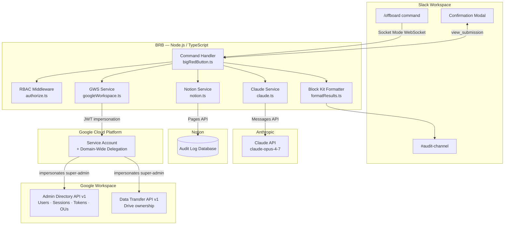
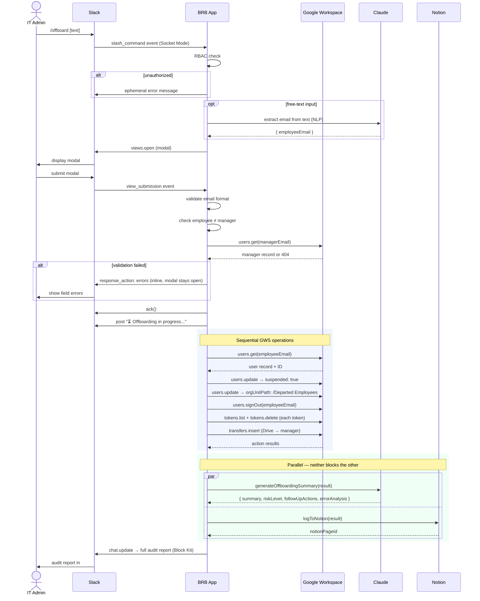
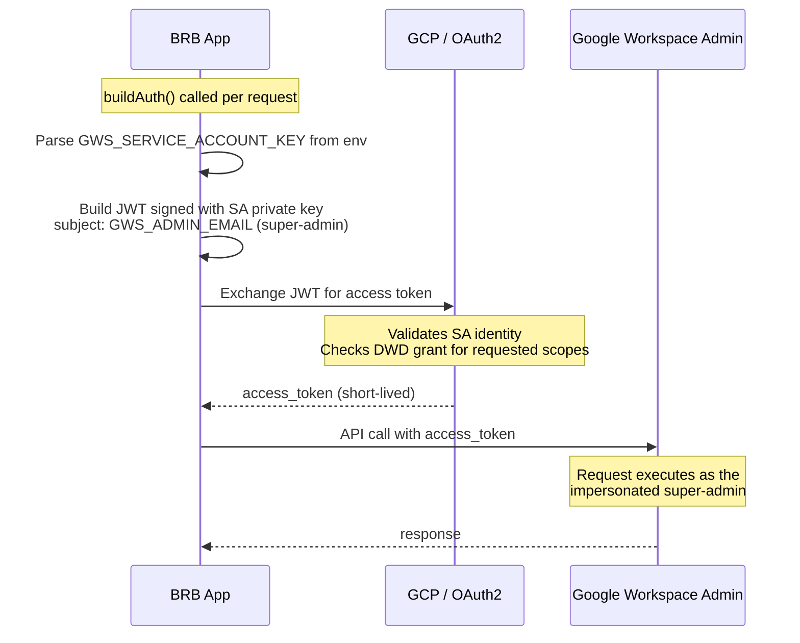
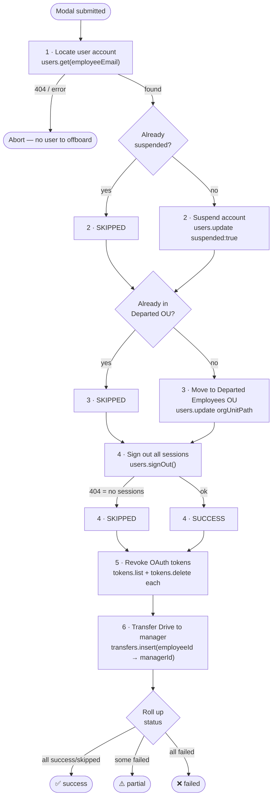
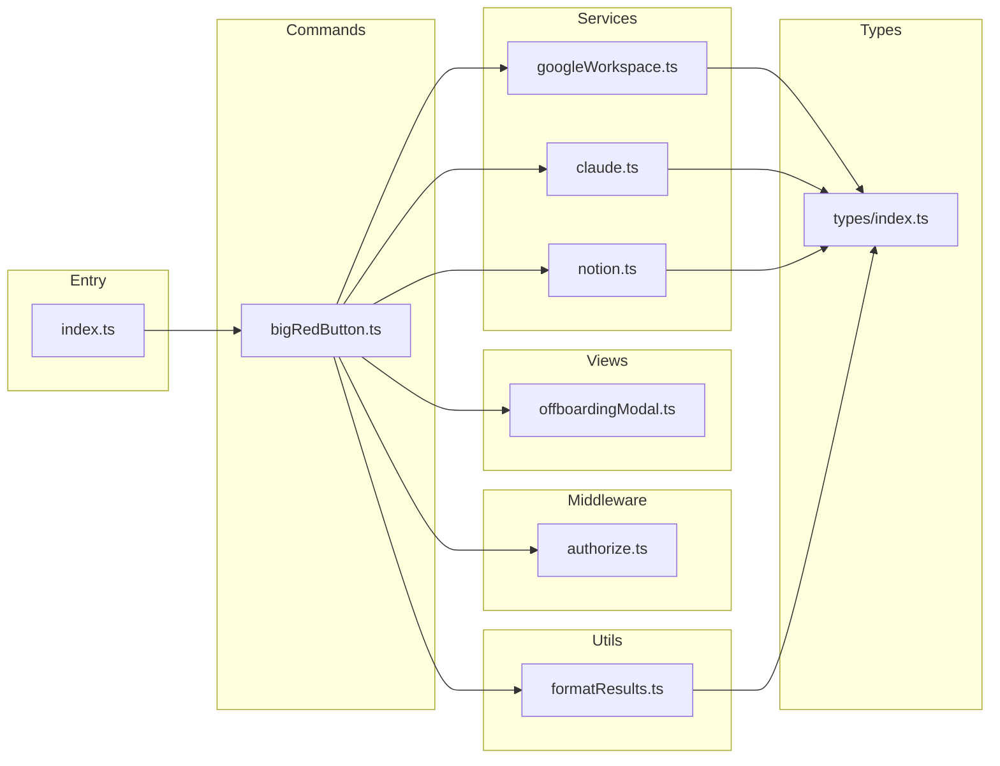
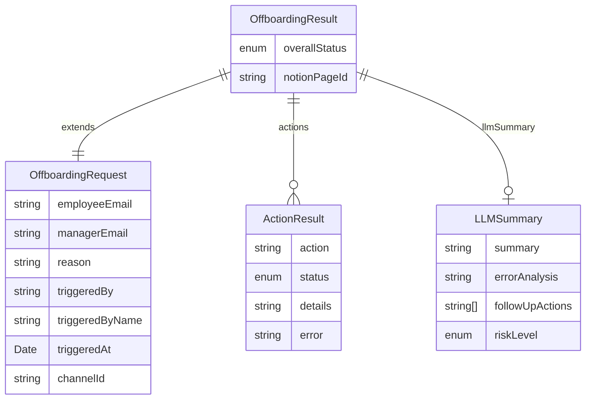

# BRB — Architecture

---

## System Overview

BRB connects four external systems. The app runs as a persistent Node.js process and communicates with Slack over an outbound WebSocket (Socket Mode) — no inbound ports or public URLs required.

---

## Request Lifecycle

Full sequence from slash command to audit report.

---

## GWS Authentication

The app never stores user credentials. A GCP service account with Domain-Wide Delegation impersonates a super-admin at request time.

**Scopes granted via DWD:**

| Scope | Purpose |
|---|---|
| `admin.directory.user` | Read users, suspend, change OU |
| `admin.directory.user.security` | Sign out sessions, list/revoke OAuth tokens |
| `admin.datatransfer` | Initiate Drive ownership transfer |

---

## GWS Offboarding Steps

Each step is independent — a failure does not abort subsequent steps. Overall status rolls up from individual results.

---

## Module Dependencies

---

## Data Model

